 

## 👨‍💻 About Me

 

### 🐍 Watch the snake eat my contributions

<picture>
  <source media="(prefers-color-scheme: dark)" srcset="https://raw.githubusercontent.com/sourabhsp23/sourabhsp23/output/github-snake-dark.svg">
  <source media="(prefers-color-scheme: light)" srcset="https://raw.githubusercontent.com/sourabhsp23/sourabhsp23/output/github-snake.svg">
  
</picture>

 

## 🧰 Tech Stack

**⚡ Languages &amp; Databases**

**🤖 AI / ML &amp; Backend**

**🛠️ Tools &amp; Platforms**

 

**✨ Also building with**

 

## 📊 GitHub Stats

  

### 🏆 Highlights

  

### 📈 Contribution Graph

 

## 💞️ Let's Build Together

I'm open to collaborating on **AI, ML, data science, and backend** projects. If you're working on anything around machine learning, data analysis, or backend systems — let's connect!
 

 

## 📫 How to Reach Me

## 😄 Pronouns
He/Him

## ⚡ Fun Fact
I love exploring new things and immersing myself in music — whether it's discovering new technologies or listening to different genres, I always enjoy learning and experiencing something fresh!

 

  

*⭐️ Always learning, always building.*

<!---
sourabhsp23/sourabhsp23 is a ✨ special ✨ repository because its `README.md` (this file) appears on your GitHub profile.
You can click the Preview link to take a look at your changes.
--->
